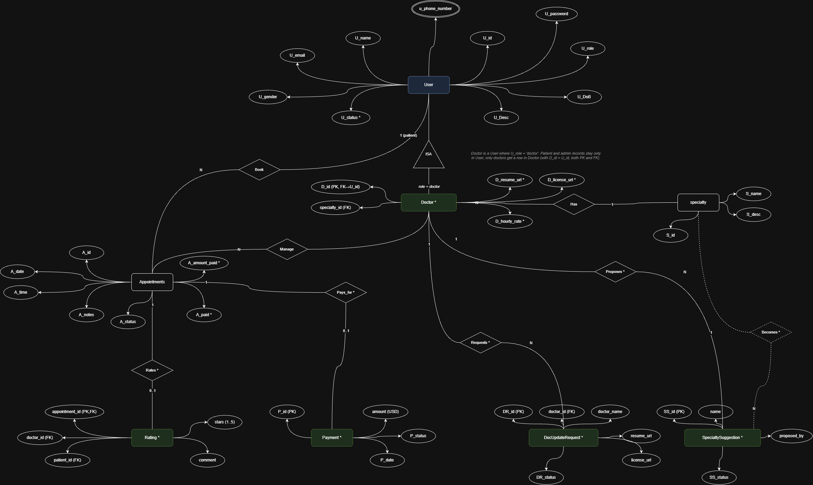
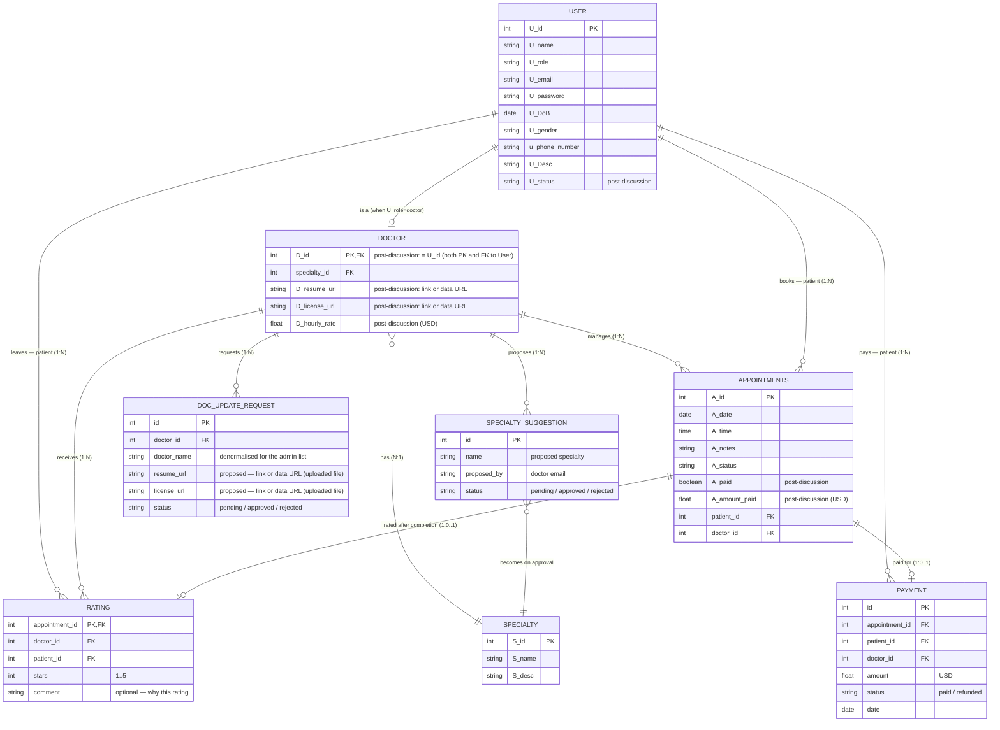

# RESTCareFul — ER Diagram (Mermaid)

The data model behind this Django backend (shared with the
[useCare](https://github.com/DevAbdoTolba/useCare) React frontend). The drawio
source is [`ERD.drawio`](./ERD.drawio) — open it in [diagrams.net](https://app.diagrams.net)
and look at the **"ERD — post-discussion"** page, which is the one these Django
models implement. The three original entities (User / Specialty / Appointments)
keep the diagram's field names (`U_*`, `S_*`, `A_*`).

Everything tagged **(post-discussion)** was added after the lecturer review:
the new **Doctor** subtype (ISA of `User` when `U_role = 'doctor'`) holding all
doctor-only fields, plus the new Rating, Payment, SpecialtySuggestion and
DocUpdateRequest entities.

## Diagram (Chen notation, exported from drawio)

*Vector version: [`ERD.svg`](./ERD.svg) · editable source: [`ERD.drawio`](./ERD.drawio)
("ERD — post-discussion" page).*

## Same model in Mermaid (renders inline on GitHub)

## Relationships

| From | To | Verb | Cardinality |
|------|----|------|-------------|
| User | Doctor | ISA | every User with `role=doctor` has exactly one Doctor row; patient and admin users have none *(post-discussion: class-table inheritance — `D_id = U_id`)* |
| Doctor | Specialty | Has | many doctors → one specialty *(post-discussion: moved off User, since only doctors have a specialty)* |
| User | Appointments | Book | one patient → many appointments |
| Doctor | Appointments | Manage | one doctor → many appointments *(post-discussion: moved off User)* |
| Appointments | Rating | Rated | each completed appointment → at most one rating *(post-discussion)* |
| Doctor | Rating | Receives | a doctor receives many ratings *(post-discussion)* |
| User | Rating | Leaves | a patient leaves many ratings *(post-discussion)* |
| Appointments | Payment | Paid for | each appointment → at most one payment *(post-discussion)* |
| User | Payment | Pays | one patient → many payments; platform keeps a 12% cut *(post-discussion)* |
| Doctor | SpecialtySuggestion | Proposes | a doctor proposes specialties the admin approves into Specialty *(post-discussion)* |
| Doctor | DocUpdateRequest | Requests | a doctor files resume/license changes the admin approves back onto Doctor *(post-discussion)* |

## Notes on the additions

- **Doctor (ISA subtype of User)** — **class-table inheritance**: every Doctor
  row has `D_id = U_id` (both PK *and* FK to `User`). Patient and admin records
  live only in `User`; users with `role=doctor` get an extra `Doctor` row that
  holds the doctor-only attributes. All relationships that only make sense for
  a doctor (`Has` specialty, `Manage` appointments, `Receives` ratings,
  `Proposes` SpecialtySuggestion, `Requests` DocUpdateRequest) hang off
  `Doctor`, not `User`.
- **D_resume_url / D_license_url** — required at doctor signup; the admin opens
  both before approving or rejecting the account. Each field stores either a
  link (`https://…`) or a `data:` URL when the doctor uploaded a file directly.
- **D_hourly_rate** — the consultation fee shown to patients and charged
  through the PayPal sandbox at booking time.
- **Payment** — `amount_paid` on the appointment is the per-booking record;
  `Payment` rows are the ledger the admin dashboard sums (total paid + 12%
  platform revenue).
- **SpecialtySuggestion** — a doctor whose specialty isn't listed proposes one;
  approving it creates a real `Specialty`.
- **DocUpdateRequest** — already-approved doctors can't silently swap their
  resume/license. They file a `DocUpdateRequest`; admin approval patches the
  matching `D_resume_url` / `D_license_url` back onto `Doctor`.
